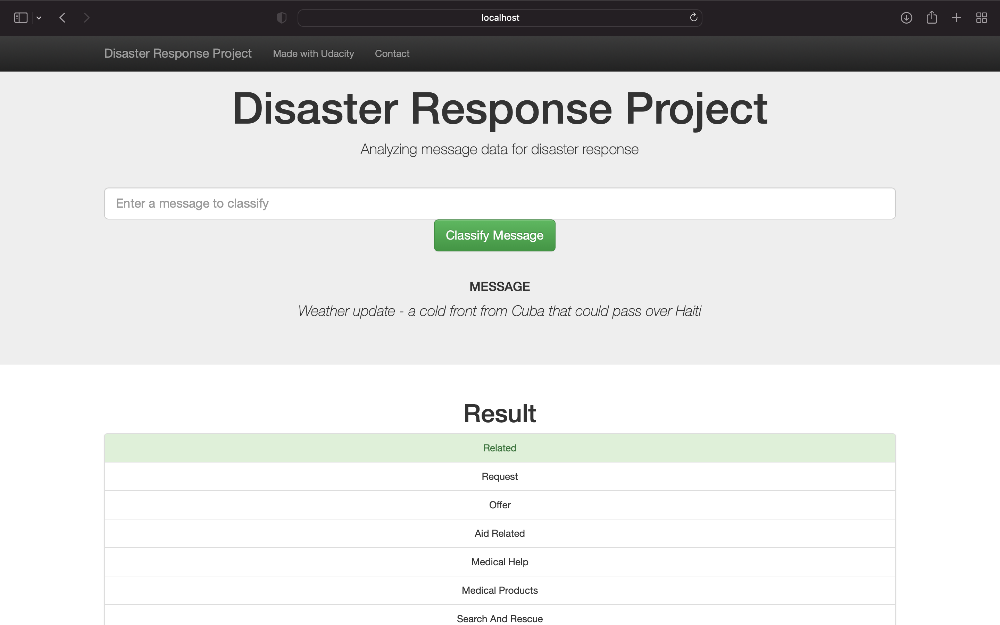

# Disaster Response Pipeline Project

## Description

This Project is the 2nd part of Data Science Nanodegree Program by Udacity.
The initial dataset contains pre-labelled tweet and messages from real-life disaster. 
The aim of the project is to build a Natural Language Processing tool that categorize messages.

The Project is divided in the following Sections:

1. Data Processing, ETL Pipeline to extract data from source, clean data and save them in a proper databse structure
2. Machine Learning Pipeline to train a model able to classify text message in categories
3. Web App to show model results in real time. 

## Dependencies
* Python 3.5+ (Python 3.8 used)
* Machine Learning Libraries: NumPy, SciPy, Pandas, Sciki-Learn
* Natural Language Process Libraries: NLTK
* SQLlite Database Libraqries: SQLalchemy
* Web App and Data Visualization: Flask, Plotly

## Installing
Clone this GIT repository:
```
git clone https://github.com/skim21/DSND_Project_2_DisasterResponse.git
```

## Instructions:
1. Run the following commands in the project's root directory to set up your database and model.

    - To run ETL pipeline that cleans data and stores in database
        `python data/process_data.py data/disaster_messages.csv data/disaster_categories.csv data/DisasterResponse.db`
    - To run ML pipeline that trains classifier and saves
        `python models/train_classifier.py data/DisasterResponse.db models/classifier.pkl`

2. Run your web app: `python app/run.py`

3. Open your browser and type `0.0.0.0:3000` in the address bar to open the homepage

## License
[](https://opensource.org/licenses/MIT)

## Screenshot4

This is an example of a message you can type to test Machine Learning model performance.
Click **Classify Message** and the categories with highlighted will be highlighted in green.


